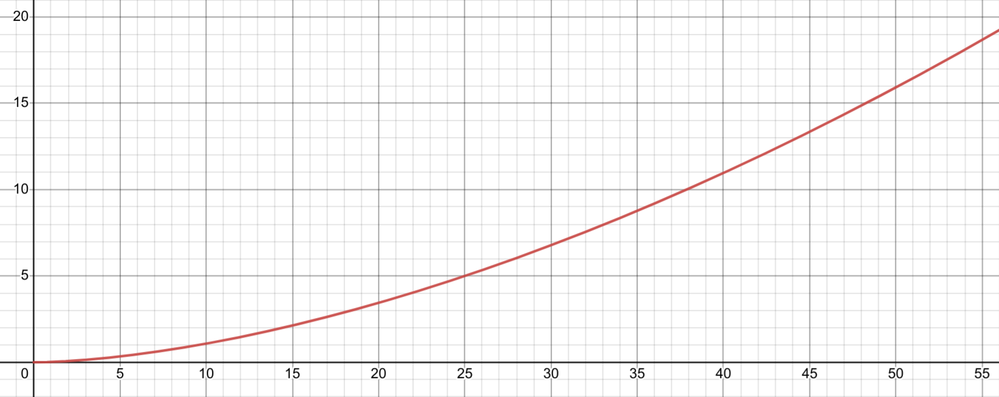
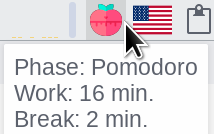

# Work-break balancer for XFCE desktop environment

## Introduction
This balancer tracks your work time and suggests rest time accourding to this [graph](https://www.desmos.com/calculator/duqezlkow8):



where a horizontal axis is for working and a vertical one for resting.

It passes through both the [Pomodoro Technique](https://en.wikipedia.org/wiki/Pomodoro_Technique) and the [52/17 rule](https://en.wikipedia.org/wiki/52/17_rule).

The more you work, the more rest you need per working minute.
If you rest less than suggested and start to work again, what usually happens sometimes anyway,
it remembers non-rested work time by subtracting actual rest time from needed rest time and converting it into work time by the graph.
For example, if you work for 52 minutes, it suggests you rest for 17 minutes.
Then, if you only rest for 12 minutes and then work 27 minutes,
it suggests you rest for 17 minutes (not just ~6 minutes for 27 minutes of the latest work time).

It beeps when work time is 25 and 52 minutes and when rest ends.

## Dependencies

* [xfce4-genmon-plugin](https://docs.xfce.org/panel-plugins/xfce4-genmon-plugin/start)
* [xdg-utils](https://www.freedesktop.org/wiki/Software/xdg-utils/) (to install icons)

## How to install

### Build and install the executable

You will need the Rust programming language and its cargo package manager installed on your system.

See the official documentation [here](https://www.rust-lang.org/tools/install) to get it installed.

Then run this command and remember the path where the executable has placed:
```sh
cargo install --path .
```

### Install required icons

To install the required icons execute this command:

```sh
./install_icons.sh
```


### Add the application to XFCE panel

Add a new item of type `Generic monitor` onto the panel and open the list of all panel items.
Hover your mouse over the added item and remember the number after the `genmon-`.
Open properties for the item and set the command to the executable path.
Disable the label and set the period to 1 second, then save.

Bind the application with the item by replacing `item_id` with the number you have remembered and running this command:
```sh
cargo run -- bind_plugin_id item_id
```

You can click the item or add a keyboard shortcut (e. g. on the Pause/Break button) to the executable path followed by the `toggle` parameter to start/stop tracking work time.

You can hover your mouse over the item to show the phase, the work and break time, and the end of the break:



## Icon sources

 [tick icons created by Roundicons - Flaticon](https://www.flaticon.com/free-icons/tick "tick icons")

 [pomodoro icons created by Freepik - Flaticon](https://www.flaticon.com/free-icons/pomodoro "pomodoro icons")

 [speed icons created by Freepik - Flaticon](https://www.flaticon.com/free-icons/speed "speed icons")

 [headache icons created by surang - Flaticon](https://www.flaticon.com/free-icons/headache "headache icons")

 [food icons created by Freepik - Flaticon](https://www.flaticon.com/free-icons/food "food icons")