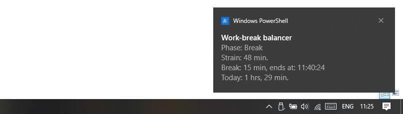

# Work-break balancer for Windows / MacOS / Linux desktops



## Introduction
This balancer can track your work time and suggest break time. It uses this [graph](https://www.desmos.com/calculator/duqezlkow8) by default,
where the horizontal axis is for work time, and the vertical axis is for break time. It passes through the [Pomodoro Technique](https://en.wikipedia.org/wiki/Pomodoro_Technique) (25/5) and the [52/17 rule](https://en.wikipedia.org/wiki/52/17_rule). The formula can be adjusted (see the configuration section below).

The more you work, the more break you need per work minute. Sometimes, you have to start working without waiting until you have rested suggested time. In this case, this balancer accumulates strain by subtracting the actual break time from the needed break time and converting the result into work time back. It adds up to the following work on the next break.

This balancer sends you notifications on the following events:
* Work lasted for 25 minutes
* It lasted for 52 minutes
* It lasted for the daily work time limit if it configured
* Break ended

The notification contains the current phase, strain, needed break, its end if it starts, and work time today.

## How to install

### Compatibility

Windows 8+ (derived from dependencies, tested on Windows 10)

MacOS 10+ (derived from dependencies, not tested)

Linux/BSD: (should work with many distributions, tested on Arch Linux)

### Download an executable

Download a suitable executable from [releases](https://github.com/ShadoySV/work-break/releases) and copy it to some directory that lists in your PATH.

### With Cargo

You will need the Rust programming language and its cargo package manager installed on your system. See the official documentation [here](https://www.rust-lang.org/tools/install).

To install it on Windows, see the requirement [here](https://github.com/BenjaminRi/winresource#compiling-on-windows).

Run this command to install the app:
```
cargo install work-break
```

## How to use

Configure the following command to launch the balancer on startup to get notifications:
```
work-break
```

Configure a shortcut key or create a desktop icon to switch between work and break time:
```
work-break switch
```

Configure a shortcut key or create a desktop icon to notify about the current status:
```
work-break notify
```

## Configuration

After the first app launch, you can change the formula's **(break = a * (work ^ b) + c)** coefficients (work and break compute in seconds), daily work time limit (in minutes, zero turns the notification off), and hour when work days start at (from 0 to 23) by editing the following configuration file, or you can delete the file to get defaults:

##### Windows
```
%APPDATA%\work-break\config\default-config.toml
```

##### Unix
```
~/.config/work-break/default-config.toml
```

Then restart your system or ask the app to apply the configuration:

```
work-break reload
```

# Similar projects

[Bartib](https://github.com/nikolassv/bartib) is a simple time tracker for the command line. It saves a log of all tracked activities as a plaintext file and allows you to create flexible reports.
